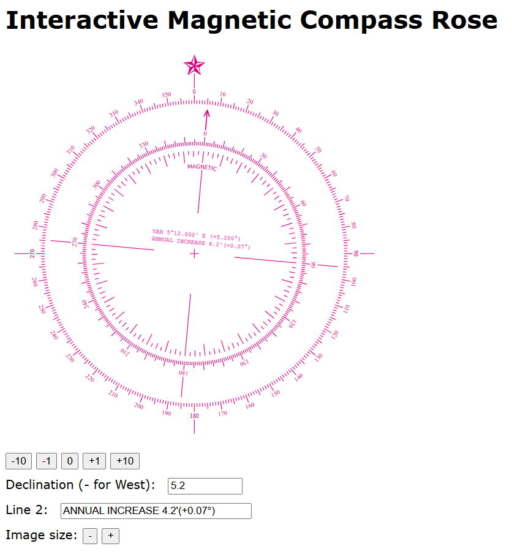

# interactiveMagneticCompassRose
A nautical compass rose comprising of True and Magnetic North scales, allowing to change the magnetic declination

# Introduction
A **"compass rose"** or otherwise called a "wind rose" is mainly found in nautical charts and maps used for navigation purposes. The compass rose helped to plan a route by identifying the direction of travel. The navigator plotted a line from the current position to the destination or to a point of interest. Afterwards, he used a tool called ["biparallel"](https://en.wikipedia.org/wiki/Parallel_rulers) to transfer the line inside the compass rose, with the line passing through the center of the compass rose. He could then read the destination of travel directly on the compass rose. 

In order to avoid as much as possible the errors caused by the physical movement of the biparallel, multiple compass roses were printed on the map, so that the navigator would select the one closest to the original plotted line.

The compass rose in some maps contained only one single protractor or as I will refer to it otherwise as "compass", where the top side was oriented to true North. Most nautical maps contained compass roses having two concentric protractors, one inside the other, where one was oriented to true North and the other to magnetic North. The difference between the orientation of the two protractors is refered to as [magnetic declination](https://en.wikipedia.org/wiki/Magnetic_declination) or magnetic deviation. This apparatus made also possible the conversion of measurements taken with a magnetic compass to true headings of the map, since maps are oriented to the true North on their top side. Also, made possible the conversion of a true heading to a magnetic heading and then use the magnetic compass to steer the vessel.

In addition to its practical use, the compass rose has been used massively for ornamental purposes to exhibit seamanship, wealth from naval operations etc.

# What is the purpose of this work
Compass roses with the double protractors are printed with a magnetic declination, which is specific for a geographic location and for a date. The location of the magnetic North is drifting due the changes in the movement of the earth's ferrite core. Therefore, each area needs to print their own maps. Also, maps should be regularly updated with the most current magnetic declination.

What I wanted to create is a digital compass rose that can be set to a desired magnetic declination. This new rose could be used eventually for navigational training or any other publishing purpose.

# How to use

 Store the HTML file `interactiveMagneticCompassRose.html` in the file system of your computer, tablet or mobile phone. Open the file with any browser. The HTML file contains all information necessary to operate and does not rely to any additional files. Therefore, it can be opened and run, even without an internet connection. This feature is very helpful in case the user is at open seas or inside an airplane.
 
The user may input the desired magnetic declination in the input box. The number format allows for number from `+0` to `+180` degrees to indicate an East magnetic declination, or from `-0` to `-180` for a West magnetic declination. Decimal digits can be used. **Please note that the decimal point should be a dot `.`**. Commas are not supported as decimal points since I have made the choice to avoid localization issues. The user may check the first informational line of the rose to see the corresponding deeclination value in degrees and minutes.

The internal protractor which indicates the magnetic North is then rotated automatically to the desired declination and finally the image can be printed or transferred to a publication document.

Several buttons are available to rotate the magnetic protractor by the amount shown on the button, or to reset the magnetic protractor to 0 declination, by pressing the `0` button. The use of the buttons is mainly for teaching or just playing around, since a more formal use of the application would require to input the declination with a precision of some decimal digits, usually 3.  

The internal protractor presents also two informational lines:
 - The first line is set automatically to depict the set declination. This is shown with the indication `VAR`, followed by the declination in the common format used for maps, in degrees and minutes, accompanied by the symbols `E` for Eastern declination, or `W` for Western declination. Inside a parenthesis, the declination is also presented as a decimal number.
 -  The second line can be customised by the user, by inputting a text in the input box. The purpose of this line is to simulate the information about the change of the declination in the passage of time, such as `2003 ANNUAL INCREASE 4.2'` to indicate that the deviation value of the first line should be adjusted (increased or decreased) by the value in the second line, usually depicted in minutes of arc. In this example, if the year is 2005, the user should add 8.4 minutes to the declination of line 1.
 
 After the user sets the declination and optionally the information line 2, the data are stored in local storage, at a physical location depending on the browser. Please check the [Caveats](#caveats) section for concerns regarding the informational lines.
 
 The user may increase or decrease the size of the compass rose, using the `Image size` buttons `+` and `-`, as well as restore the image to the original size, using the `Default` button.
 

 
  

 
# Caveats
The application is designed for local use. It is one single HTML page residing in a local folder of a computer. The informational lines, the declination and the line that can be set manually by the user, are stored locally using the [Javascript Local Storage](https://developer.mozilla.org/en-US/docs/Web/API/Window/localStorage). They are stored in unencrypted form and therefore **cannot be used for any personal or confidential data**. 

The application does not exercise any control on the user input. Therefore, if the page is published on a web server, it may be prone to various types of attacks, giving control of the computer to malicious users. 

***IT IS STRONGLY SUGGESTED NOT TO USE WITH A WEB SERVER. THE AUTHOR IS NOT RESPONSIBLE FOR ANY DAMAGES. PLEASE REFER TO THE LICENSE DOCUMENT.***

# Attributions 

## Source
The original SVG file was located in https://commons.wikimedia.org/wiki/File:Modern_nautical_compass_rose.svg and exists here in its original form in folder `/attributed`

Copying from the wikimedia page file information:
> - Description	A modern nautical compass rose. The outer circle (true rose) is aligned with true north; the inner circle (magnetic rose) with magnetic north. Inside the magnetic rose there is also an older 32-point graduation.
> - Date	15 August 2007
> - Source	Redrawn in Inkscape; based on a public domain file created by NOAA.
> - Author	Mysid https://en.wikipedia.org/wiki/User:Mysid
> 
>Licensing: "This image is in the public domain because it contains materials that originally came from the [U.S. National Oceanic and Atmospheric Administration](https://en.wikipedia.org/wiki/National_Oceanic_and_Atmospheric_Administration), taken or made as part of an employee's official duties." 

## Modifications to the original Source
 1. The source SVG file was restructured, both in the text form using a text editor, as well as an image using Inkscape. The purpose of the modifications was to group all design elemnts into two groups, one for the true North compass and second for the magnetic North compass. This arrangement allows to introduce rotations of the magnetic compass without moving the true North compass.
 
 2. The original curved informational lines for declination were not able to be reproduced, as the curved versions could not be dynamically updated using Javascript. I resorted to simple, straight text that moves with the magnetic rose.
 
 3. The resultant SVG file was then transfered into an HTML page, where HTML and Javascript code was written to implement the interactive behaviour. 

# Licensing
Although there is a lot of Javascript code added to the SVG image, since the original source was in the public domain as mentioned by [Mysid](https://en.wikipedia.org/wiki/User:Mysid) , I decided to license:
 - the part inside the HTML file that contains the updated SVG file is offered to the public domain, as a tribute to the original source and [Mysid](https://en.wikipedia.org/wiki/User:Mysid).
  - the part that contains my code inside the HTML file (HTML and Javascript) is licensed under the not-so-much restrictive `MIT license`, with the purpose of indemnifying me against any potential damages. 
  
If someone wishes to use this work and finds this licensing scheme restrictive for a particular use, feel free to contact me.  
